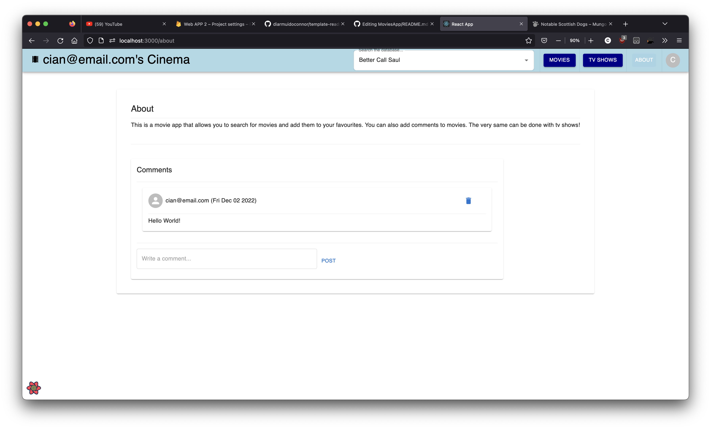
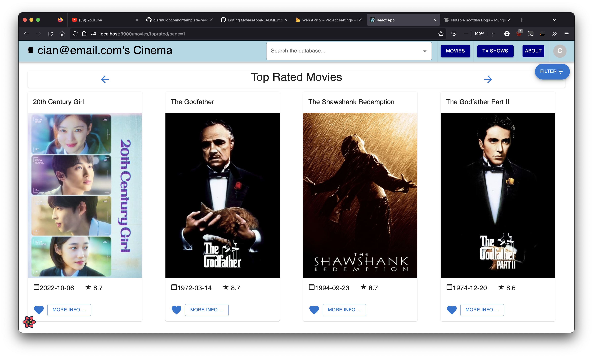

# Web App Dev 2 - Assignment 1 - ReactJS app.

Name: Cian Farrell

## Overview.

### New Pages.

e.g.

+ Added Top Rated Movies
+ Modified Movies details to include cast and similar movie details
+ Modified template movies page by moving filter card into a drawer
+ Added Discover and Top Rated TV Shows
+ Added a favourite tv shows 
+ Added TV Shows details, also including similar shows and actors
+ Added actor details which includes a bio and list of shows/movies involved in
+ Added a login page for firebase authentication
+ Added an about pag with a comment section

### New Features.

+ Authentication (using Firebase)
+ View and favourite TV shows
+ Movie And Show favourites, muswatch and reviews and comments are all backend persistent using firestore
+ Favourites and upcoming are persisted unique to each user.
+ Search the database with a search bar
+ Filter actors movies/shows
+ View through pages of movies and shows

## Setup requirements.

Ensure all required node packages are installed and run npm start.
Alternatively check out this deployment: https://cinematime.netlify.app

## TMDB endpoints.
    
+ /movies/toprated - Top rated movies
+ /tv/toprated - Top rated shows
+ /tv/{tv_id} - TV Details
+ /tv/{tv_id}/similar - Similar TV Shows
+ /movie/{movie_id}/similar - Similar Movies
+ /search/multi - Searches shows, movies and actors
+ /person/{person_id} - Person details
+ /person/{person_id}/movie_credits - Person movie roles
+ /person/{person_id}/tv_credits - Person TV roles
+ /tv/{tv_id}/credits - Cast of show
+ /movie/{movie_id}/credits - Cast of movie

## App Design.

### Component catalogue.

n/a

### UI Design.

>Shows a small about page about the app, and allows users to comment on the app.

>Shows a bio of an actor and their filmography.

>Filter card moved to drawer

>Lists all shows, note pagination at bottom, this is present on all list views.

>Lists shows favourited by a user. 

>The state of the login page when logged in

>Login page when logged out.

>Movie page details including actors and similar movies

>Show details, including actors and similar shows

>List views by toprated for movies and shows.

### Routing.

+ /person/:id - Details on an actor
+ /login - Page that provides login functionality
+ /page=:pageNumber - paginated movies page
+ /tvshows/page=:pageNumber - paginated shows page
+ /tvshows/favourites - Favourite tv shows
+ /tvshows/toprated/page=:pageNumber - paginated toprated shows
+ /movies/toprated/page=:pageNumber - paginated toprated movies
+ /movies/upcoming/page=:pageNumber - paginated upcoming movies
+ /about - an about section to the app

>Everything  besides the login page requires authentication

## Independent learning (If relevant).

+ Firebase - used for authentication. Guide used for firebase: https://youtu.be/9bXhf_TELP4
+ Firestore - used for backend persistence in storing favourites etc. Gude used for firestore: https://youtu.be/jCY6DH8F4oc

